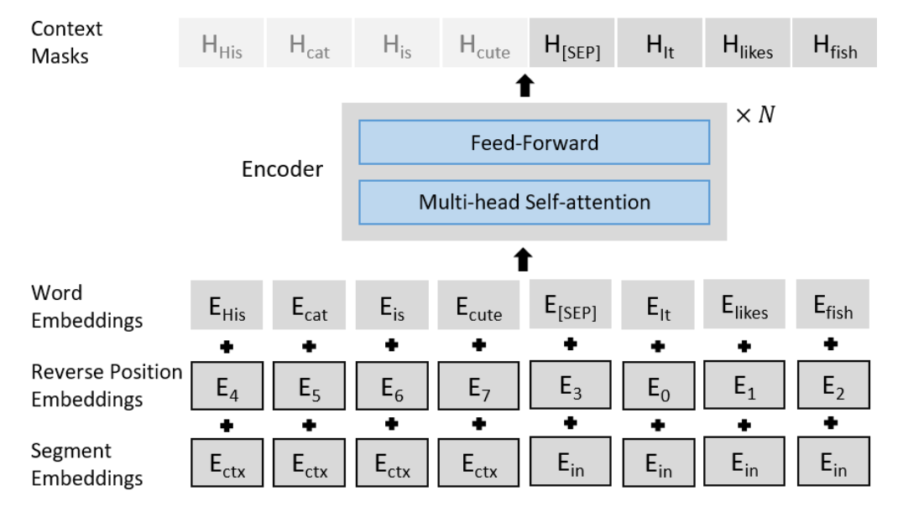

- date: 20200518 
- author: Hamson

## Plan
Read the paper "Pretrained Language Models for Document-Level Neural Machine Translation", and then investigate for similar works, i.e., PLM for MT.

## Notes
This paper focuses on Document-level Neural Machine Translation (NMT) -- taking document-level context information into consideration when translating current sentence.

Incorporating large contexts could result in unstable training and introduce much irrelevant information. To alleviate these, the authors propose:

- Use BERT to initialize parameters of the encoder and fine-tune later.   
- Use one single encoder to encode the concatenation of input and contexts, and add the following manipulation:
   - *Segment Embedding*: input and context different embedding;
   - *Reversed Position Embeddings*: first assign position embeddings to the input, and then contexts;
   - *Context Mask*: mask the contexts when decoding.
- Add multi-task learning: masked language model (MLM) prediction.

**Beam search**: (B is beam width) when generating the first word, consider B most possible words; when generating the k-th word (k>1), consider the B most possble word sequences, based on the B most possble k-1 word sequences. It is better than greedy search, since it can produce more concise and precise translation. In this paper, B is 4, length penalty(**?**) is 1.

Dataset: **IWSLT** (Zh-En, Fr-En and Es-En)
## More
Learn about length penalty: "Google’s neural machine translation system: Bridging the gap between human and machine translation"

More papers:

- Zhang et al.: *Improving the transformer translation model with document-level context*
- Jean et al.: *Does neural machine translation benefit from larger context?*
- Miculicich et al.: *Document-level neu- ral machine translation with hierarchical attention networks*