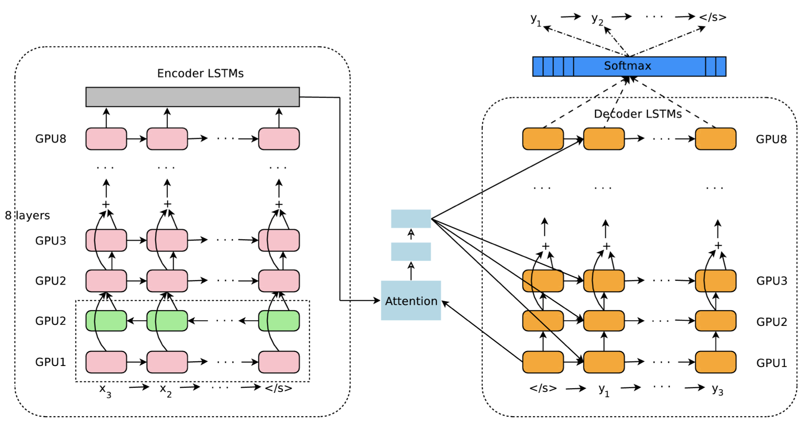

- date: 20200524 
- author: Hamson

## Plan
Read the paper on GNMT: "Google’s Neural Machine Translation System: Bridging the Gap between Human and Machine Translation". Understand how a NMT work, and what is *length penalty* (stated in 20200518.md).

## Notes
The overall concepts in GNMT:

- 8-layer LSTM (both encoder and decoder).
	- The first layer of encoder is bi-directional, others are uni-directional (for parallelism).
- Residual connections between layers.
	- without residual connections, input in i-th layer at time step t: $$ \mathbf{x}^i_t = \mathbf{h}^i_t $$
	- with residual connections, input in i-th layer at time step t: $$ \mathbf{x}^i_t = \mathbf{h}^i_t + \mathbf{x}^{(i-1)}_t $$
	- Residual connections greatly improve the gradient flow in the backward pass, which allows us to train very deep encoder and decoder networks.
- Attention: between bottom layer decoder and top layer encoder (for parallelism); attention function is a feed forward network with one hidden layer.
- Wordpieces (sub-word units) to deal with rare words.
	- For processing arbitrary words, we first break words into wordpieces given a trained wordpiece model.
	- Special word boundary symbols are added. For example:
	
- Training loss: maximizing the sum of log probabilities of the ground-truth outputs given the corresponding inputs: $$ \sum_{i=1}^n log P_\theta(Y^{*(i)}| X^{(i)}) $$
	- Model refinement: incorporating the task reward (RL)
- Length normalization and coverage penalty in beam search (*length penalty* is probably length normalization).
	- The equations for length normalization and coverage penality:
	
- Datasets: WMT En->Fr, WMT En->De
- Train details:
	- Adam then SGD
	- Model quantization (drastically accelerates translation inference) (not understand, Page 9-11)
 

## More
- Try to find or implement a simplified version of GNMT.
- Check about the datasets.
